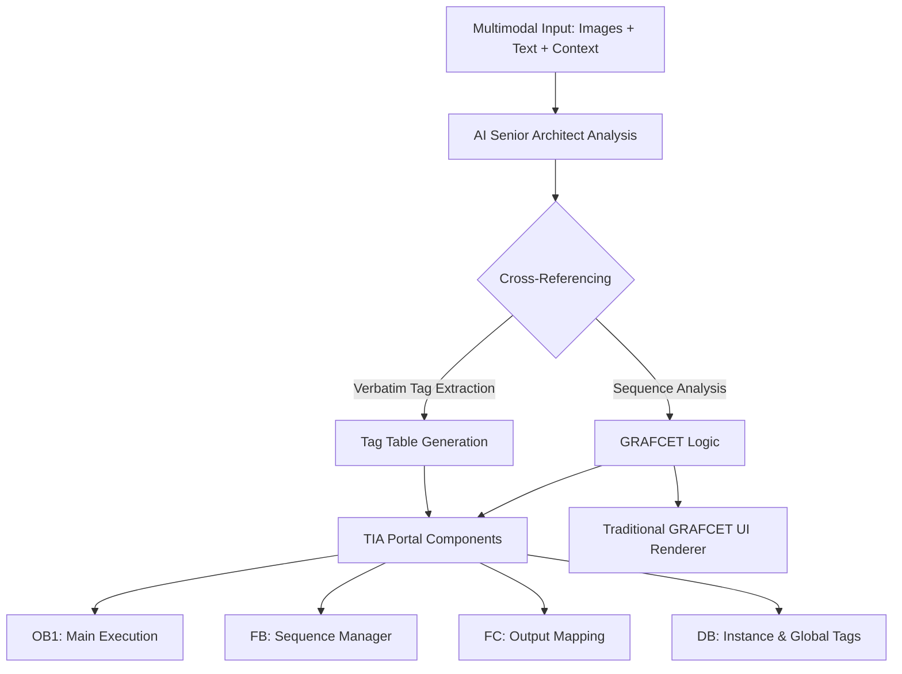

# ⚡ Ladder2Grafcet | TIA Portal Architect

[](https://opensource.org/licenses/MIT)
[](https://antigravity.google)
[](https://new.siemens.com/global/en/products/automation/industry-software/automation-software/tia-portal.html)

**Ladder2Grafcet** is a professional AI-driven tool designed for industrial automation engineers. It transforms Ladder (KOP) logic descriptions and visual captures directly into standardized GRAFCET (SFC) diagrams and generates TIA Portal-compatible SCL/AWL source code.

---

## 🏗️ System Architecture

The following diagram illustrates the multimodal cross-analysis flow (Grounding) that the system uses to generate the output:



---

## 🚀 Key Features

- **Multimodal AI Analysis**: Processes text-based Ladder descriptions, technical context, and direct screenshots of TIA Portal environments.
- **Verbatim Tag Fidelity**: Prioritizes extraction of exact symbolic names and physical addresses (%I, %Q, %M) from visual sources.
- **Traditional GRAFCET UI**: Renders diagrams in the traditional IEC 61131-3 industrial style.
- **TIA Portal Ready**: Generates structured SCL/AWL code ready for import into Siemens PLCs.

---

## 🛠️ Installation & Setup

### Prerequisites

- **Python 3.x** (Optional, for backend extensions)
- **Moderna Web Browser** (Chrome/Edge recommended)
- **TIA Portal Version Control Interface (VCI)** for easy code import.

### Configuration

1. **Clone the Repository**:
   ```bash
   git clone https://github.com/ExcrementGassosPudoros/Lector-exercici-a-grafcet.git
   cd Lector-exercici-a-grafcet
   ```

2. **Open the Application**:
   Simply open `index.html` in your browser. No server environment is strictly required for the frontend.

3. **API Key Setup**:
   - Obtain a [Gemini API Key](https://aistudio.google.com/).
   - Enter it in the application's configuration header.

---

## 📖 Usage Manual

### 1. Providing Input
- **Text Mode**: Paste your Ladder networks as text (e.g., `NW 1: |--[ START ]--| ( STEP_0 )`).
- **Vision Mode**: Upload screenshots of your TIA Portal "PLC tags" table or "Program blocks".
- **Context**: Add the exercise description to improve AI reasoning of time-based transitions.

### 2. Interpreting the Output
- **GRAFCET**: Review the visual sequence. Step 0 is the initial state. Actions are shown to the right (Output | Type | Tag).
- **SCL Source**: Copy the generated code for OB1, FB, FC, and DB from the tabs and paste them into TIA Portal SCL blocks.

---

## 🎓 Junior to Senior: Educational Tutorial

### Transitioning from Timing Diagrams to GRAFCET
Many automation students struggle to move from a linear cronogram to a robust sequence. 

**Steps for success:**
1. **Identify States**: Look for distinct phases where outputs don't change. These are your **Stages**.
2. **Define Triggers**: Look for sensor changes or time completions between phases. These are your **Transitions**.
3. **Map Outputs**: Assign PLC tags to each stage's action box. Use **N** for continuous and **S/R** for memory-based actions.

---

## 🧪 Technologies
- **Core AI**: Google Gemini Pro 1.5 / Flash (v1.5 & 2.0)
- **Visualization**: Custom HTML/CSS Engine (SFC Standards)
- **Frontend**: Vanilla JS, CSS Glassmorphism
- **Documentation**: Mermaid.js

---

## 📄 License
Distributed under the MIT License. See `LICENSE` for more information.

---
*Created by [ExcrementGassosPudoros](https://github.com/ExcrementGassosPudoros) with the support of Antigravity AI.*
